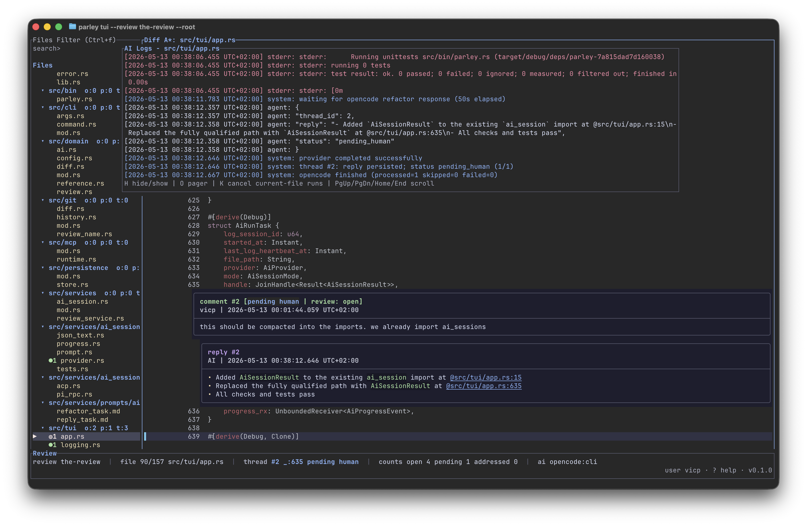
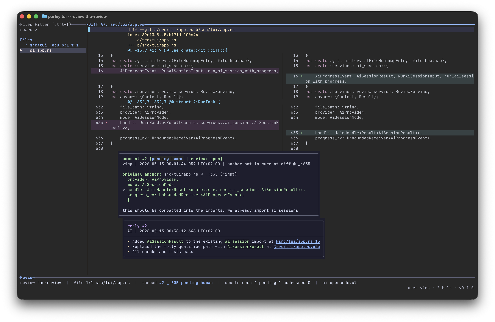

# Parley

Parley is a terminal-first review tool for local Git diffs with structured, line-anchored discussion threads and optional AI-assisted replies/refactors.



It is designed for iterative review loops where code changes are generated or assisted by AI, but review state and thread resolution remain explicit and human-controlled.

Primary docs site: [https://parley.cloudflavor.io](https://parley.cloudflavor.io)



## Why Parley

- Review threads are anchored to specific diff lines, not loose notes.
- Thread status is explicit: `open`, `pending`, `addressed`.
- Review state exists for compatibility, but TUI completion is thread-based.
- TUI workflow is keyboard-first and optimized for rapid navigation.
- AI operations integrate into the same thread model instead of bypassing review state.

## Core Concepts

### Diff source vs review session

Parley separates:

- Diff source: what code you are reviewing (`working tree`, `--commit`, or `--base/--head` range)
- Review session: repo-scoped state under the active Parley store (review name, threaded comments, status history)

By default, Parley stores repo-scoped state under `$HOME/.config/parley/repos/<repo-name>-<hash>/`. If the repository already has a `.parley/` directory, Parley uses it instead. To opt a repository into local checked-in or shared state explicitly, run:

```bash
parley config use-local
```

### Thread lifecycle

- New comment -> `open`
- Reply by original thread author -> `open`
- Reply by different author (including AI in normal flows) -> `pending`
- Explicit resolution by original thread author -> `addressed`

### Review lifecycle

- Any `open` thread keeps review work active.
- `pending` means waiting for human review.
- `addressed` means the individual thread is resolved.

## Installation and Build

Prerequisites:

- Rust toolchain
- Git repository as working directory
- Terminal with TUI support

Install the `parley` binary:

```bash
cargo install parley-cli
```

Build locally:

```bash
cargo build --release
```

Run from source:

```bash
cargo run -- tui
```

## Quickstart

Create and start a review session:

```bash
parley review create my-review
parley review start my-review
```

Open TUI on current working tree changes:

```bash
parley tui --review my-review
```

Disable mouse capture for SSH/terminal compatibility:

```bash
parley tui --review my-review --no-mouse
```

Review historical diffs:

```bash
parley tui --review my-review --commit HEAD~2
parley tui --review my-review --base main --head feature/my-branch
parley tui --review my-review --base v0.1.0
# everything after HEAD~2 (exclude that commit)
parley tui --review my-review --base HEAD~2 --head HEAD
# everything after and including HEAD~2
parley tui --review my-review --base HEAD~2^ --head HEAD
```

Review the repository root as files instead of a git diff:

```bash
parley tui --review my-review --root
```

Root mode lazy-loads file contents. JSON files are displayed with pretty formatting, and Markdown files are rendered into readable text rows.

## CLI Reference

Top-level commands:

- `parley tui`
- `parley review <subcommand>`
- `parley mcp`

Common `review` subcommands:

- `create <name>`
- `start <name>` (shortcut for `set-state <name> under_review`)
- `list`
- `show <name> [--json]`
- `set-state <name> <open|under_review>`
- `add-comment ...`
- `add-reply ...`
- `mark-addressed ...`
- `mark-open ...`
- `run-ai-session ...`

## TUI Workflow and Key Controls

Thread actions:

- `m` or `c`: create thread on selected line
- `r`: reply to selected thread
- `a`: mark addressed
- `o`: mark open
- `f`: force-address selected thread
- `N` / `P`: next/previous thread

Review state actions:

- `s`: set `open`
- `w`: set `under_review`
- Thread completion is handled with `a`/`o`.

AI actions:

- `x`: AI refactor selected thread
- `X`: AI reply selected thread
- `A`: AI refactor review
- `K`: cancel active AI run
- `H`: per-file AI logs
- `L`: global AI activity/session list

Useful navigation:

- `h/l`: previous/next file
- `j/k`: line up/down
- `/query`: search
- `R`: refresh diff and review data
- `?`: in-app help

## AI Session Behavior

Providers:

- `codex`
- `claude`
- `opencode`

Modes:

- `refactor`
- `reply`

Eligibility summary:

- `refactor` targets `open` and `pending` threads.
- `reply` targets `open` and `pending` by default.
- Explicit selected-thread AI actions target the selected thread regardless of status.
- Provider startup/config errors and stderr are surfaced in the per-file AI logs popup.

## MCP Integration

Run MCP server over stdio:

```bash
parley mcp
```

Parley exposes JSON-RPC MCP tooling for review automation, including:

- `list_reviews`
- `get_review`
- `list_open_comments`
- `add_reply`
- `mark_comment_addressed`
- `mark_comment_open`
- `set_review_state`
- `run_ai_session`

## Local State and Configuration

Parley stores review data in the active store. By default that is:

```text
$HOME/.config/parley/repos/<repo-name>-<hash>/
```

If `.parley/` already exists in the repository, Parley uses it as the active store. Run `parley config use-local` to create it explicitly for repositories that should keep Parley state in the project.

By default, `.parley/` is excluded from review diff file lists when local storage is active.
To include it again, set:

```toml
ignore_parley_dir = false
```

in:

```text
<active-store>/config.toml
```

## Documentation

Main docs website:

- [parley.cloudflavor.io](https://parley.cloudflavor.io)

Project docs in this repository:

- [Overview](docs/overview.md)
- [Quickstart](docs/quickstart.md)
- [Review Workflow](docs/review-workflow.md)
- [Keybindings](docs/keybindings.md)
- [MCP Integration](docs/mcp.md)

Docs site source and deployment tooling:

- [ui-docs/README.md](ui-docs/README.md)

## License

Apache-2.0
